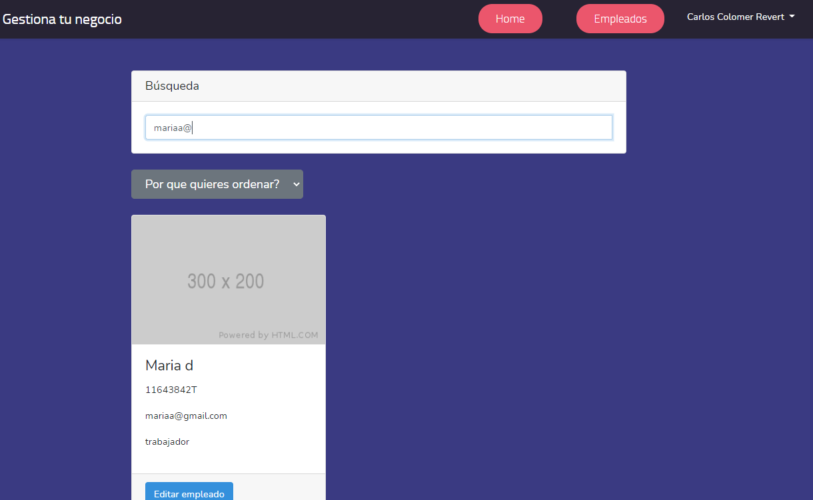
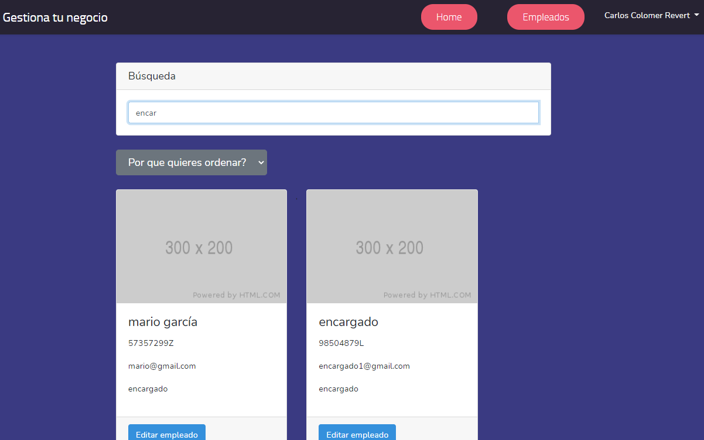
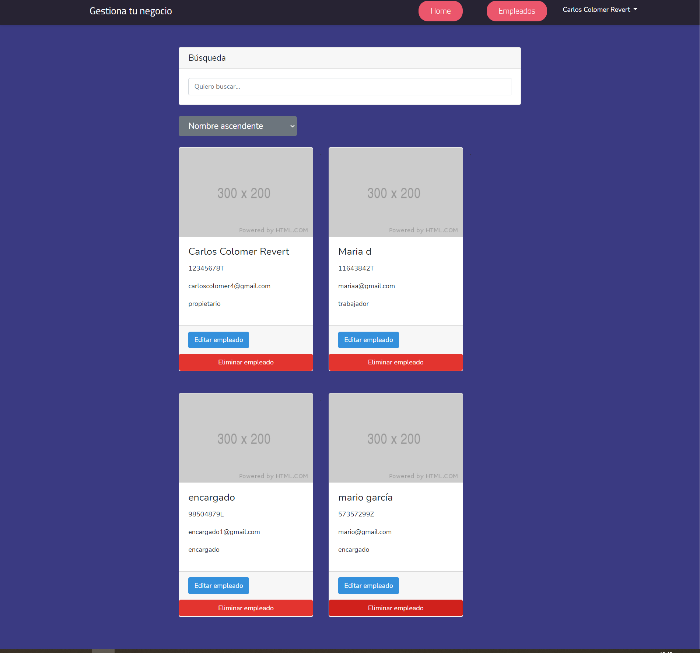
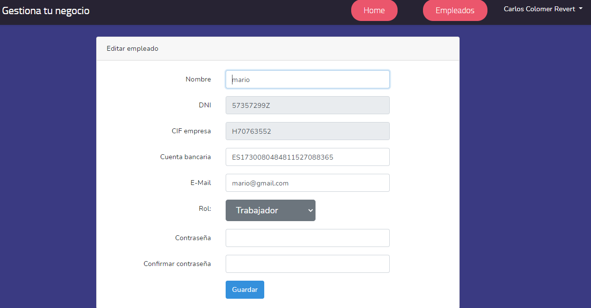
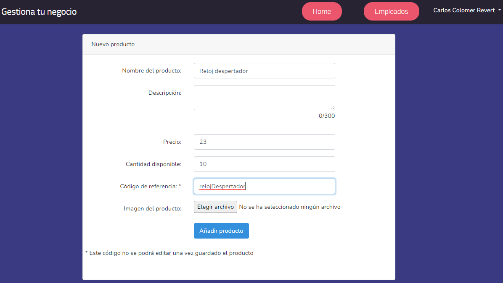
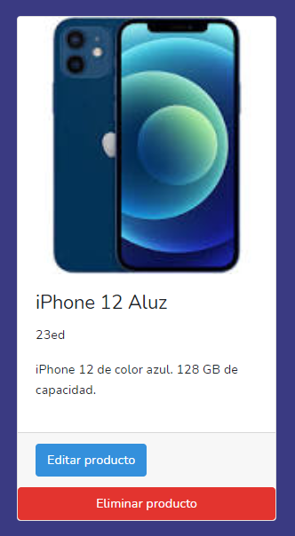

# Gestiona Tu Negocio

Índice

1. Descripción
2. Planificación
3. Análisis de requisitos
4. Diseño
5. Implementación
6. Futuras implementaciones
7. Conclusiones
8. Anexos

## 1. Descripción y objetivos

El objetivo de realizar este proyecto recae en la necesidad que puede que tengan algunos pequeños negocios de gestionar el stock del cual dispongan.
También para tener centralizada la información de sus empleados, ya que contratar o crear un ERP puede ser muy costoso, pese a la existencia de existir ERP libres,  mi web quiere cubrir esa necesidad.

En esta aplicación web, nos encontramos con una jerarquía de usuarios dentro de una misma tienda:

- Usuarios:
  - **propietario**:\
  Es el encargado de registrar la tienda en el sitio web, con toda la información que esto conlleva (datos personales, cif, dirección...).

    Dicho usuario tendrá todo el control sobre la aplicación, pudiendo hacer realizar la creación, lectura, actualización y borrado de usuarios, los cuales serán de rol encargado o trabajador, así como de los productos disponibles en su tienda.
    Así mismo, podrá eliminar la tienda de nuestra aplicación, cuya acción eliminará todos los datos de nuestra BD, dicha acción será irreversible, previa notificación.
  - **encargado**:\
  Este usuario será creado previamente por el propietario, y tendrá permisos para realizar la creación, lectura, modificación y borrado de los productos de la tienda.
  - **trabajador**:\
  Este encargado también será creado por el usuario propietario, y dentrá la posibilidad de modificar el stock de los productos de la tienda y del precio, pero no tendrá la posibilidad de crear nuevos, ni de eliminar los existentes.

//TODO: mover esto al apartado del diseño
Todos ellos, se almacenarán en una tabla donde se encontrarán los datos necesarios para la empresa para tener los datos centralizados para ellos, como el nombre, IBAN, email, DNI... Este último será el que se usará como identificador para poder editar y eliminar los usuarios, por lo que tras la inserción, este dato no podrá ser modificado.

Respecto a los productos, estos serán almacenados en una tabla donde los datos que se recogen, serán el nombre, descripción, stock, código de referencia... entre otros. El código de referencia, está indicado en la vista de creación que no se podrá modificar una vez añadido el producto, ya que se usa como identificador a la hora de editar y eliminar los productos.

A parte de la tabla con la información de los usuarios y de los productos, también dispondremos de una tabla donde se almacenan todas las tiendas registradas en nuestra aplicación.\
En esta, tendremos almacenados los datos como el nombre, ubicación, CIF... entre otros campos, de este modo, tanto los productos como los empleados, tendrán una clave ajena, indicando a que tienda pertenecen.

En mi aplicación he usado **Google Firebase** para almacenar las imágenes de los productos de las tiendas, para así no sobrecargar la carga de la web, dado que las imágenes las obtiene de un servidor externo.\
De este modo, la carga se realiza más rápida dado que no dependemos del ancho de banda de nuestro proveedor del host.

## 2. Planificación

La ejecución del proyecto se ha desarrollado durante los meses de Marzo, Abril y Mayo.

Aquí podemos ver un diagrama Gantt con el tiempo que se le ha dedicado a cada parte.

TODO: INSERTAR IMAGEN AQUÍ

## 3. Análisis de requisitos

- Req. a: Un usuario anónimo solo tendrá acceso a la vista de *welcome*.\
En esta vista, solo habrá el manual de como se usa nuestra aplicación, así como a las opciones de menú de Registro y Login.

- Req. b: Un usuario anónimo puede registrarse en la aplicación como usuario propietario de un nuevo negocio. Introducirá esta información:
   - Datos personales:
     - Nombre
     - DNI (Formato correcto y único)
     - Email (Formato correcto y único)
     - Contraseña (Han de coincidir)
  - Datos de la empresa:
     - Nombre
     - CIF (Formato correcto y único)
     - Dirección
     - Ciudad
     - País

- Req. c: El usuario propietario puede crear usuarios de tipo encargado y trabajador. Para cada uno de ellos, se tendrá la siguiente información:
  - Nombre
  - DNI (Formato correcto y único)
  - IBAN (Formato correcto)
  - Email (Formato correcto y único)
  - Rol
  - Contraseña (Han de coincidir)

- Req. d: El usuario propietario puede listar todos los trabajadores, y ver sus detalles.
- Req. za: El usuario propietario puede buscar entre sus trabajadores por su nombre, dni, rol o email.
- Req. zb: El usuario propietario puede ordenar la búsqueda de sus trabajadores por rol, nombre ascendente o nombre descendente.
- Req. e: El usuario propietario puede modificar cualquier campo de un usuario, incluido él mismo salvo el campo DNI.
- Req. f: El usuario propietario puede borrar cualquier otro usuario, excepto a si mismo.
- Req. g: El usuario propietario puede dar de baja su cuenta junto con toda la información de su negocio (usuarios, productos y la propia tienda).
- Req. h: El usuario propietario  puede crear productos. Para cada uno de ellos, se incorporará la siguiente información:
    - Nombre
    - Descripción
    - Precio
    - Stock disponible
    - Código de referencia (No modificable a posteriori).
    - Imagen del producto

- Req. i: El usuario propietario puede listar los productos.
- Req. j: El usuario propietario puede editar los productos, salvo el código de referencia.
- Req. k: El usuario propietario puede eliminar los productos.
- Req. l: El usuario encargado puede crear productos, con los mismos datos que proporciona el usuario propietario.
- Req. m: El usuario encargado puede modificar productos.
- Req. n: El usuario encargado puede eliminar productos.
- Req. ñ: El usuario encargado puede editar sus datos como trabajador, salvo el DNI.
- Req. o: El usuario trabajador puede listar los productos.
- Req. p: El usuario trabajador puede modificar el stock y el precio de los productos.
- Req. q: El usuario trabajador puede listar los empleados.
- Req. r: El usuario trabajador puede modificar sus datos de trabajador, salvo el DNI.
- Req. s: El usuario superUsuario puede listar todas las tiendas registradas en nuestra aplicación.
- Req. t: El usuario superUsuario puede modificar todas las tiendas registradas en nuestra aplicación, excepto el CIF.
- Req. u: El usuario superUsuario puede eliminar todas las tiendas registradas en nuestra aplicación, eliminando así a los trabajadores y los productos correspondientes a esa tienda.
- Req. v: El usuario superUsuario puede listar todos los empleados registradas en nuestra aplicación.
- Req. w: El usuario superUsuario puede modificar todos los empleados registradas en nuestra aplicación, excepto el DNI.
- Req. x: El usuario superUsuario puede eliminar todos los empleados registradas en nuestra aplicación.

## 4. Diseño

## 5. Implementación

## x. Despliegue

Para realizar el despliegue de la aplicación, primero de todo probé en host gratuitos, como hostinger, pero la transferencia de ficheros, que se realiza mediante protocolo FTP, era muy lento, por lo que opté a adquirir un servidor en IONOS.\
En este caso, la transferencia de archivos era mucho más rápida, pero a la hora de realizar la implementación, llegaron los problemas, por ejemplo:
 - Problemas a la hora de visualizar la página web, dado que poniendo el dominio, simplemente mostraba la página de inicio por defecto, y no lo que había en la carpeta /public, que es de donde parte Laravel.
 - Modifiqué donde apuntaba la raiz del directorio, para poder visualizar la página web.
 - Investigué como crear un fichero .htaccess, que estructura tenía que tener, y que poner, para que obtuviera los recursos (css, imágenes...) de la web, y no la mostrara como texto plano.
 - Finalmente no conseguí que funcionara la parte de las rutas de Laravel en el servidor, ya que el framework, tiene hace unas rutas, para llamar a un fichero....
 TODO: Acabar este últim punt

## x. Pruebas

- **Prueba Req a.** Cuando el usuario no está logeado, e intentamos acceder al home o a añadir un empoleado, vemos como nos redirige al login:

Introducimos manualmente en la barra de direcciones del navegador, para acceder al home:

Pulsamos enter para acceder a esta url, y nos redirige al login:

Ahora realizamos la misma comprobación, esta vez intentando acceder a la ventana de nuevo empleado:

Comprobamos como se vuelve a redireccionar al login:

- **Prueba Req b.** Cuando accedemos a la ventana *Registrarse*, visualizamos un formulario donde podremos crear nuestra cuenta:

Comprobamos que se valida el formato del email:

Comprobamos que con el formato del email correcto, el mismo no esté registrado previamente en nuestra BD:

Comprobamos que el formato del CIF es valido:

Con un CIF valido, comprobamos que ese mismo CIF no exista en la BD, si es así, mostraremos un error:

Comprobamos que el formato del DNI es correcto:

Comprobamos que con el formato del DNI correcto, no esté duplicado en la BD:

Introducimos dos contraseñas distintas, y vemmos como nos sale el error de que no coinciden:

- **Prueba Req C**. Cuando creamos la tienda y nuestro usuario, vemos que nos redirige a una ventana donde crear trabajadores. Comprobamos que valida que el DNI no esté registrado:

Comprobamos el formato del DNI:

Comrobamos el formato del IBAN:

Comrpobamos que las contraseñas coincidan:

Comprobamos el formato del correo:

Comprobamos que el correo no exista:

   - **Req d**. Accedemos a la pestaña de empleados, y vemos la lista de todos nuestros empleados:

  - **Req za**. Comprobamos que podemos buscar a través del nomrbe:

   Comprobamos que podemos buscar por el email:

  Comprobamos que podemos buscar por el rol 

  Comprobamos que podemos buscar por el dni:

- **Req. zb**. Comprobamos que los trabajadores se ordenan por rol:

Comprobamos que los trabajadores se ordenan por nombre ascendente:

Comprobamos que los trabajadores se ordenan por nombre descendiente:

- **Req. e**. Pulsamos sobre el botón editar empleado, y se nos abre una ventana con todos sus datos para editar, excepto el campo del DNI y el CIF empresa, los cuales están deshabilitados:

Cambiamos los datos del empleado anterior:

Le damos al botón "Guardar", y se nos redirigirá a la venetana de empleados, donde podremos ver el cambio en el nombre y su rol:

- **Req. f**. Comprobamos que el propietario puede eliminar un empleado, para ello, pulsamos sobre el botón eliminar y nos aparecerá la siguente ventana:

Si indicamos que si, nos elimina el usuario de la BD,y nos sale la siguietne ventana:

Una vez hacemos click para cerrar esa ventana PopUp, comprobamos que efectivamente, se ha eliminado el empleado, haciendo uso de la barra de búsqueda, introducimos el DNI o el nombre el empleado que hemos eliminado, y vemos que ya no aparece:

Comprobamos que cuando intenta elimiarse a si mismo, sale una alerta impidiendo dicha acción:

- **Req. g**. //TODO

- **Req. h**. El usuario propietario crea un producto, llenando los datos necesairos:

Pulsamos en "Añadir producto", y se nos redirige a la ventana principal, donde podemos buscar el producto que hemos introducido:

- **Req. i**. Comrpobamos que puede listar todos los productos que hay en la tienda:

- **Req. j**. Comrobamos que puede editar todos los campos de un producto, excepto el código de referencia:

Modificamos los datos que queremos cambiar:

Pulsamos sobre el botón guardar, y en el listado de productos, vemos como se han cambiado los datos:

- **Req. k**. En el listado de productos, pulsamos para eliminar un producto, y nos aparecerá la siguiente ventana popUp:

Cuando indicamos que queremos eliminar el producto, nos aparecerá esta ventana si todo ha ido bien:

Hacemos click en "Ok", para cerrar la ventana popUp, y vemos como en el listado de productos ya no aparece:

## x. Integración de los módulos del ciclo

- 1º Programación
  - De lenguajes de programación, para crear la app se ha usado PHP, bajo el framework de Laravel.
  Gracias a los conocimientos adquiridos de programación Orientada a Objetos, me ha permitido ser mas agil a la hora de adquirir los conocimientos necesarios de como realziar las clases con Laravel.
- 1º BBDD
  - Para almacenar la información de la aplicación, se ha utilizado la base de datos de MariaDB, en su versión 10.4.14, con el motor de vista web PHPMyAdmin, para la creación de las bases de datos SQL.
  - Para almacenar las imágenes, se ha utilizado la función Storage, de Google Firebase, la cual nos permite almacenar archivos en su sistemas, con límites gratuitos. suficientes para esta aplicación.
- 1º Entornos de desarrollo
  - De este módulo, he utilizado el desarrollo de las pruebas del software, para realizar las pruebas de mi aplicación, para ver que todo funcione correctamente.\
   En este caso, han sido pruebas de caja negra.
  - También, gracias a los conocimientos adquiridos con los IDEs, me ha resultado sencillo adaptarme, en mi caso a VSCode, y a instalarme los plugins necesarios, los cuales me han ayudado con la agilidad de programación, como pueden ser *CSS Formater* y *Format HTML in PHP*, los cuales me han venido muy bien a la hora de formatear el código.
  - Otra herramienta que aprendí en este módulo y me ha servido para el desarrollo de mi proyecto, ha sido GIT, en mi caso, he utilizado GitHub, para llevar un control de versiones, para poder ir atrás si así lo necesitaba.
- 1º Lenguaje de Marcas y Sistemas de la gestión de la información
  - En este caso, ha utilizado los conocimientos adquiridos con dicho módulo con HTML, para crear mi front-end.
  - También las bases con CSS, me vinieron muy bien para empezar con el diseño básico de la aplicación.
- 1º Sistemas informáticos
  - Para el despliegue  de la web en un servidor, he hecho uso de estos conocimientos con linux, ya que era la manera con la que he interactuado con el sistema de AWS, para instalar tanto apache, como php y Laravel.
  - Para el desarrollo en local de mi proyecto, me sirvieron los conocimientos adquiridos de administración de equipo Windows, dado que es el SO con el que trabajo, la instalación y configuración de XAMMP, para tener un sistema de desarrollo en local de manera sencilla, y el sistema de transmisión de ficheros FTP, para subir el proyecto al servidor externo.
- 2º Desarrollo Web en entorno cliente
  - Para la realización de la funcionalidad con JS en este proyecto, conocimientos y recursos adquiridos en este módulo, ha servido de gran ayuda.
  - Algunos ejemplos de donde he utilizado JS, ha sido:
     - No habilitar la posibilidad de añadir un producto hasta que este tenga un código de referéncia.
     - Mostrar el contador de carácteres para la descripción de los productos.
     - Mostrar resultados de la búsqueda de empleados y productos.
- 2º Desarrollo Web en entorno servidor
  - De este módulo, he necesitado las aptitudes obtenidas para la comunicación entre el servidor y la BD, a la hora de almacenar, obtener y editar los datos que se introducían en la web.
  - También me ha servido de ayuda la introducción que se nos hizo en dicho módulo con Laravel 5, ya que me proporcionó las herramientas y los conocimentos básicos para empezar con mi proyecto.
- 2º Despliegue  de aplicaciones web
  - En este módulo, se nos enseñó a como realizar  el despliegue de aplicaciones web, y estos conocimientos han sido de ayuda a la hora de saber como debía de instalar Laravel 8 en mi equipo.
  - Asimismo, estos conocimentos me ayudarlon a la hora de instalar Laravel 8 en el servidor externo.
- 2º Diseño de interfaces Web
  - Me ha servido de ayuda el conocimiento adquirido en este módulo para saber a como organizar la vista de los productos y de los empleados en formato Flexbox, así como la creación del CSS.
  - Además de la integración de nuevas fuentes de texto bulletproof, y la creación de un diseño responsive, para adaptar la vista a todo tipo de pantallas.
 

## 7. Conclusiones

### 7.1 Futuras implementaciones

## x. Glosario

## x. Bibliografía

## 8. Anexos

